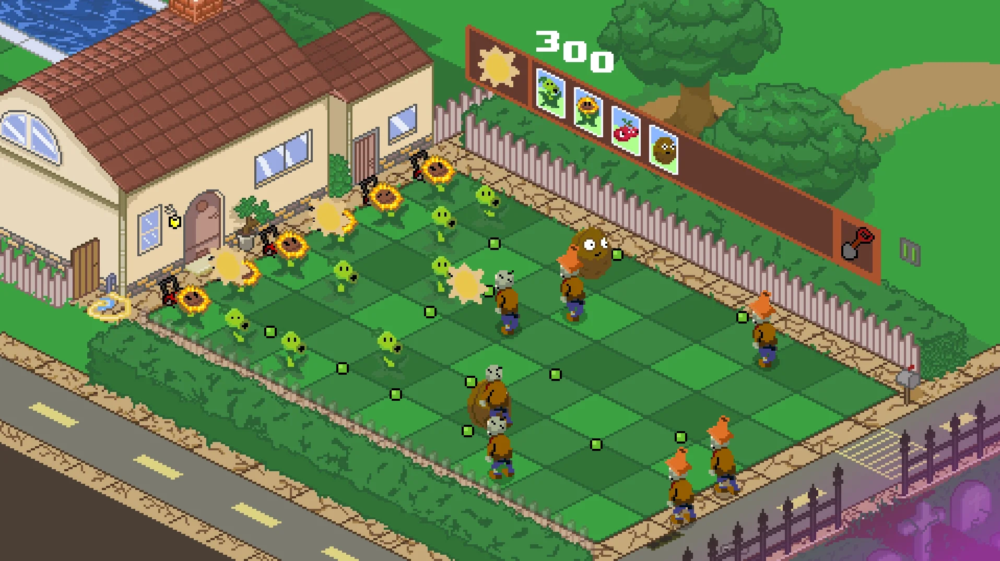

# PvZ-Isometric-Game

This is a game I've made in LibGDX. It's purpose is to show that I am capable of writing advanced Java code, such as anonymous classes, singletons, inheritence, polymorphism, generics and lambdas. All the art I've made myself, and I have tried to make it as close to hte original Plants Vs Zombies game as possible.


## Getting Started

### Dependencies

* If building project you will need gradle and java 8. Simply run one of the bash scripts depending on your OS.

```
chmod +x buildXXX.sh
./buildXXX.sh
```

### Installing

* To install download the exe/appimage/dmg from the releases tab on the right of this github page.


## Differences to PVZ

I've had to make a number of differences to the original game, mainly because of time constraints and this being a demo project. Currently there are only 4 levels and plants, I may add more in the future. I didn't add a start screen, as there is no achievement tracker and zen garden.


## Authors

Contributors names and contact info

Adam Butler
[@Shovelz](https://www.adambutlerdev.me)

## Version History

* 0.1
    * Initial Release

## Acknowledgments

* [Libgdx](https://libgdx.com)
* [Plants Vs Zombies](https://www.ea.com/ea-studios/popcap/plants-vs-zombies)
